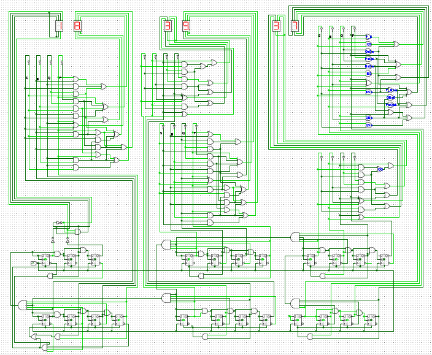

# Digital Clock with Flip Flops and Logic Gates

<center>

  

</center>

## Software

This project uses [Logisim Evolution](https://github.com/logisim-evolution/logisim-evolution) for running the simulation.

## File Descriptions

```
.
├── 24h_clock_sm.circ // full 24 hours clock using counters and decoders
├── 60m_clock.circ // full 60 minutes stopwatch using counters and decoders
├── blockdiagram.odg // basic layout view for size comparison
├── counters_x.circ // experimental file for trying out counters
├── decoder // contains 4-bit to 7-segments deocder
│   ├── 2_decoder_sm.circ // decodes 000, 001, 010 to 7-segments
│   ├── 6_decoder.circ // decodes 0000-0110(6) to 7-segments, used for displaying tens of minute and second
│   ├── 6_decoder_sm.circ // same as above, narrowed version
│   ├── bcd_decoder.circ // decodes binary coded decimals to 7-segments
│   └── bcd_decoder_sm.circ // same as above, narrowed version
└── size_comparison.circ // for comparison purpose
```
